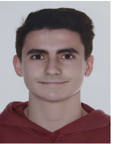

link to the figma project: https://www.figma.com/file/hvQqxp2V9rtf2ibRrdoh0C/Untitled?type=design&mode=design&t=AmaWmT44lsZTwHF6-1

Target user profile:
With this project, I aimed to create a resume in a simple and visually appealing manner. Using Figma, I found an intuitive and easy-to-use tool that allows me to highlight my skills, work experience, and education. My user profile has primarily focused on updating my resume to reflect my current journey.

Information architecture:
Since this project focuses on creating a resume in Figma, information architecture is not a relevant element in this context. The Figma design platform provides us with an intuitive and flexible interface that allows us to create and organize content freely.

Visual design:
To visually design this project, a color palette reflecting professionalism and modernity will be used. I have employed a combination of neutral tones such as white and black, along with accents of a subtle color like blue, which adds a touch of freshness and vitality.

Regarding typography, I have used a clean and readable sans-serif font, in this case, Montserrat. This font is ideal for presenting information clearly and professionally.

As for the page layout, I aimed for a clean and organized structure that facilitates resume navigation and editing. I have divided the content into well-defined sections, such as Languages, Work Experience, Education, Skills, etc. This allows me to organize my information effectively and highlight my strengths.

For inspiration, I have reviewed similar projects on design platforms and online portfolios. I have also watched YouTube videos to get an idea of what constitutes good design.

<!DOCTYPE html>
<html lang="en">
<head>
	<meta charset="UTF-8">
	<title>Resume/CV Design</title>
	<link rel="stylesheet" href="CURRICULUM1.css">
	
</head>
<body>

   

     

       
     

     

       

         

           
Marc López Vílchez

           
Computer Engineering student.

         

         <ul>
           <li>
             

               <i class="fas fa-map"></i>
             

             

               Sant Feliu de Guíxols, Girona   Spain
             

           </li>
           <li>
             

               <i class="fas fa-mobile-alt"></i>
             

             

               +34 608772976
             

           </li>
           <li>
             

               <i class="fas fa-envelope"></i>
             

             

               marclopezvil@gmail.com
             

           </li>
         </ul>
       

       

         

           
Skills

         

         <ul>
           <li>
             

               HTML
             

             

               
             

             
80%

           </li>
           <li>
             

               CSS
             

             

               
             

             
70%

           </li>
           <li>
             

               C++
             

             

               
             

             
90%

           </li>
           <li>
             

               JAVA
             

             

               
             

             
80%

           </li>
           <li>
             

               SQL
             

             

               
             

             
65%

           </li>
           <li>
            

              PHP
            

            

              
            

            
60%

          </li>
          <li>
            

              C
            

            

              
            

            
85%

          </li>
          <li>
            

              JS
            

            

              
            

            
70%

          </li>
         </ul>
       

       

         

           
Languages

         

         <ul>
          <li>
            

              SPANISH
            

            

              
            

            
100%

          </li>
          <li>
            

              CATALAN
            

            

              
            

            
100%

          </li>
          <li>
            

              ENGLISH
            

            

              
            

            
90%

          </li>
          <li>
            

              FRENCH
            

            

              
            

            
70%

          </li>
        </ul>
       

     

  

  

    

        

           
About me

         

        
Hello! My name is Marc López Vílchez. I was born on 10/11/2003, and I have a strong interest in learning and being able to help in any way.

    

    

        

           
Work Experience

         

        <ul>
            <li>
                
2020
 
                

                     
Grup Món Web SL (Informàtica Llagostera).
 
                  
Internship in computer-related tasks, web page design, and advertising.

                

            </li>
            <li>
              
2021 (June-August)

              

                     
Hostal La Marina.
 
                  
Performing receptionist services.

                

            </li>
            <li>
              
2022-2023 (June-September)

              

                     
Caprabo S.A.
 
                  
Performing sales (cashier) and restocking services.

                

            </li>
        </ul>
    

    

      

           
Education

         

      <ul>
            <li>
                
2015 - 2019
 
                

                     
ESO (HIGHSCHOOL SFG)
 
                  
Secondary education.

                

            </li>
            <li>
              
2019 - 2021

              

                     
Batxillerat (HIGHSCHOOL SFG)
 
                  
Studies in Batxillerat, technological branch.

                

            </li>
            <li>
              
2021 - Current date

              

                     
GEINF (UDG)
 
                  
Bachelor's degree studies in Computer Engineering.

                

            </li>
        </ul>
    

    

      

           
Hobbies

         

      <ul>
          <li>
              

                
Passionate about computer science, I dedicate my free time to exploring new technologies and developing computer projects. I am also enthusiastic about cybersecurity and solving algorithmic problems. My constant interest in learning and innovating is a standout feature in my professional profile. 

              

          </li>
      </ul>
    

  

</body>
</html>
